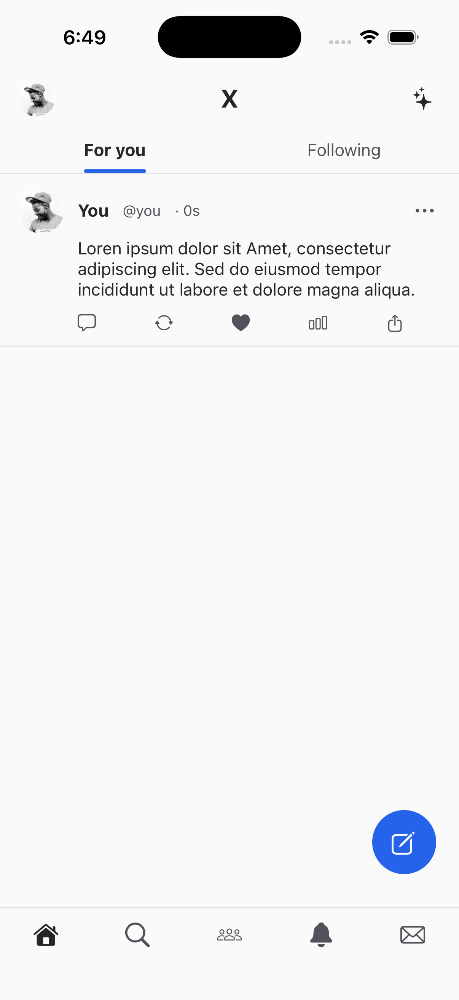
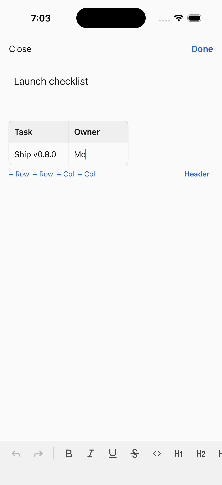
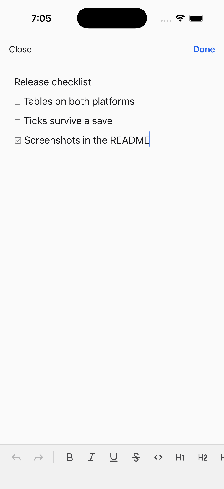
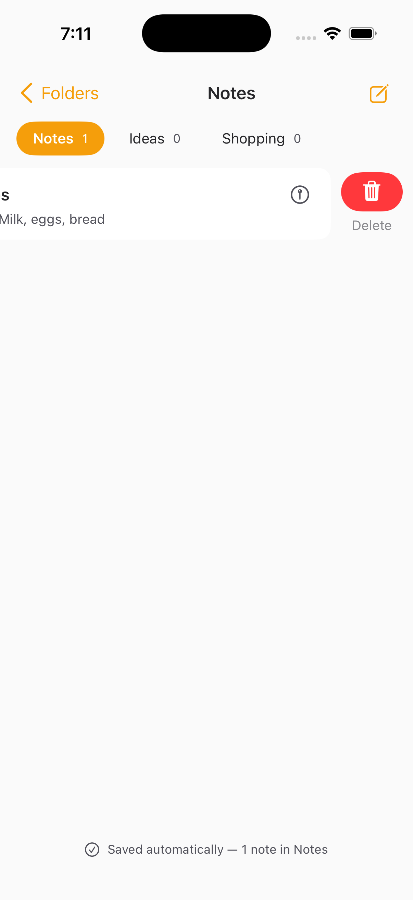

# WYSIWYG Editor — a NativePHP Mobile demo app

Nine screens, one plugin. Every screen opens the **same** native rich text
editor — [`vipertecpro/wysiwyg-editor`](https://github.com/vipertecpro/wysiwyg-editor)
— configured differently, to show how far one editor stretches before you have
to write your own.

The plugin lives in its **own repository** so you can drop it into your app.
This repo is the showcase: it holds configuration and UI, and nothing else.
Every toolbar, sheet, suggestion list, table and colour picker below is drawn
by the plugin.

No webview. No third-party editor. A native `UITextView` on iOS, a native
`EditText` on Android, and clean normalised HTML back to PHP.

---

## The five platform demos

### X — short posts

No formatting at all, a countdown ring instead of a character counter, and
drafts when you back out. `toolbar => []` is a real configuration: a plain-text
composer is a product decision, not a missing feature.

| Writing | The timeline |
| --- | --- |
|  |  |

The rows under the text — *Tag people*, *Add location*, *Everyone can reply* —
are **host accessories**: the app declares them, the editor draws them inside
its own window, and taps come back as events. The editor has no idea what a
location is.

### LinkedIn — long-form

Mentions and hashtags, host sheets over the editor's own chrome, and a
see-more clamp on the feed.

| `@` looks people up | Posted |
| --- | --- |
|  |  |

The editor spots the trigger and asks; **which** people exist is the app's
business, answered from its own database. The mention comes back in the saved
HTML as a real link.

### Facebook — a few words on a colour

Short posts become a card, and the same document renders in the feed.

| Picking a colour | The card |
| --- | --- |
|  |  |

### Notion — block-based pages

A `/` palette, tables, and to-dos whose ticks survive the save.

| `/` offers the app's own commands | A table, edited where it sits |
| --- | --- |
|  |  |



The command list is **the app's**, not the editor's. `/date` is in it precisely
because the editor has no idea what a date is: it reports the pick and the app
inserts one. That is how you add a command the plugin has never heard of.

A table saves as a real `<table>`, so whatever renders your stored markup gets
a table rather than an opaque blob.

### Apple Notes — native behaviour

No Save button anywhere, because the note is already written by the time you
would reach for one. Folders, pinning, and swipe-to-delete.

| Nothing to press | Swipe |
| --- | --- |
|  |  |

`changeDebounce` is the whole trick: the editor emits `ContentChanged` when
typing settles, the app writes it away, and `saveStyle => 'none'` removes the
button that would otherwise claim to do what the app is already doing.

### Also here

**Notes** (the full toolbar, saved to SQLite), **Comment Box** (the `comment`
preset — bold / italic / link, 500-character cap), **Composer** (every tool,
with a toggle to inspect the raw HTML), and **Branded Theme**.


---

## Running it

```bash
composer install && php artisan migrate
```

```bash
php artisan native:run ios
```

Use `android` for the Android build. The first run downloads the platform
binaries and takes a while.

**Two things that will otherwise waste your afternoon:**

- **Android** needs `ANDROID_HOME` set, and `native:run android` prints a
  success banner even when Gradle fails — read `nativephp/android-build.log`
  rather than the console.
- The app only re-extracts its bundle when the version string changes, and
  compiled Blade views live inside the app container on both platforms. After
  changing a view, clear it or you will be looking at the previous build:

```bash
adb shell pm clear com.vipertecpro.wysiwygdemo
```

```bash
xcrun simctl uninstall booted com.vipertecpro.wysiwygdemo
```

> This repo consumes the plugin through a Composer **path repository**
> (`../wysiwyg-editor`) so both can be developed side by side. To use the
> published package instead, drop that entry from `composer.json` and require
> `vipertecpro/wysiwyg-editor` normally.

---

## What an integration actually looks like

Opening the editor is one call. Everything else is an event.

```php
use Vipertecpro\WysiwygEditor\Events\ContentSaved;
use Vipertecpro\WysiwygEditor\Facades\WysiwygEditor;

WysiwygEditor::open($page->body_json ?: $page->body_html, [
    'toolbar' => ['bold', 'italic', 'h1', 'bulletList', 'checklist', 'table', 'link'],
    'triggers' => ['/' => 'command'],
    'id' => 'page-'.$page->id,
]);

#[On(ContentSaved::class)]
public function onSaved(string $html, string $text, string $json = '', ?string $id = null): void
{
    // ────────────────────────────────────────────────────────────────
    //  THIS IS WHERE YOUR API CALL GOES.
    // ────────────────────────────────────────────────────────────────
    //
    // Every screen in this demo writes to SQLite on the device, because a
    // demo has no server. You would PUT or PATCH here instead.
    //
    // You are handed the document THREE ways, and which you store is a real
    // decision:
    //
    //   $html — display markup. Normalised, safe to render.
    //   $text — the plain rendition, for search and previews.
    //   $json — the fidelity format. The ONLY one carrying which to-dos are
    //           ticked and which uploads are still in flight, so it is what
    //           you re-open the editor with.
    //
    // Media is NOT embedded in the HTML. Files come back as their own blocks,
    // so prose and attachments can be sent to different endpoints:
    //
    //   $attachments = WysiwygEditor::attachments($json);
    //   // → [['kind' => 'image', 'source' => '/var/…/IMG_0001.HEIC', …], …]
    //
    Page::whereKey((int) substr($id, 5))
        ->update(['body_html' => $html, 'body_text' => $text, 'body_json' => $json]);
}
```

Each demo screen is a `NativeComponent` plus a Blade view. The interesting part
of every one of them is the options array — that is the point.

## Tests

```bash
php artisan test
```

Beyond the models and helpers, the suite guards the things that broke here
before and would break again:

- no control is drawn whose handler does not exist;
- no handler sits on an element that cannot be pressed — `<image>` and `<text>`
  accept the directive on iOS and ignore it on Android, so a control written
  that way works on one platform and is dead on the other;
- no event directive is used that the precompiler does not recognise, because a
  misspelling is dropped in silence — `@swipe-delete` did nothing at all until
  it became `@swipeDelete`;
- no component holds state that nothing ever reads.

## Licence

MIT.
