# WYSIWYG Editor — a NativePHP Mobile demo app

Ten screens, one plugin. Every screen opens the **same** native rich text
editor — [`vipertecpro/wysiwyg-editor`](https://github.com/vipertecpro/wysiwyg-editor)
— configured differently, to show how far one editor stretches before you have
to write your own.

The plugin lives in its **own repository** so you can drop it into your app.
This repo is the showcase: it holds configuration and UI, and nothing else.
Every toolbar, sheet, suggestion list, table and colour picker below is drawn
by the plugin.

No webview. No third-party editor. A native `UITextView` on iOS, a native
`EditText` on Android, and clean normalised HTML back to PHP.

---

## Start here — the payload

Before the demos, the data. This screen shows the editor being an **API** rather
than a product, because that is what you have to understand before you can build
against it: what arrives, in what shape, and what you are expected to do with the
parts.

| The three formats, with sizes | The files, split out | Every event, in order |
| --- | --- | --- |
| 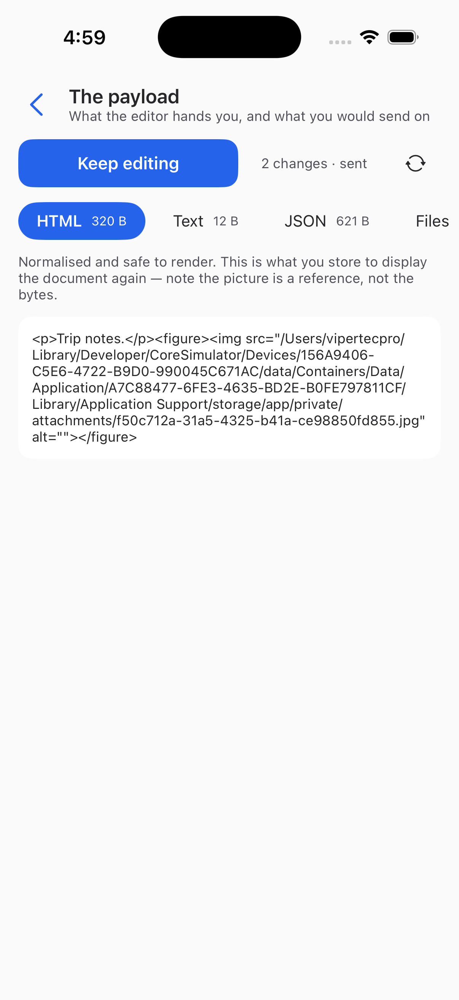 | 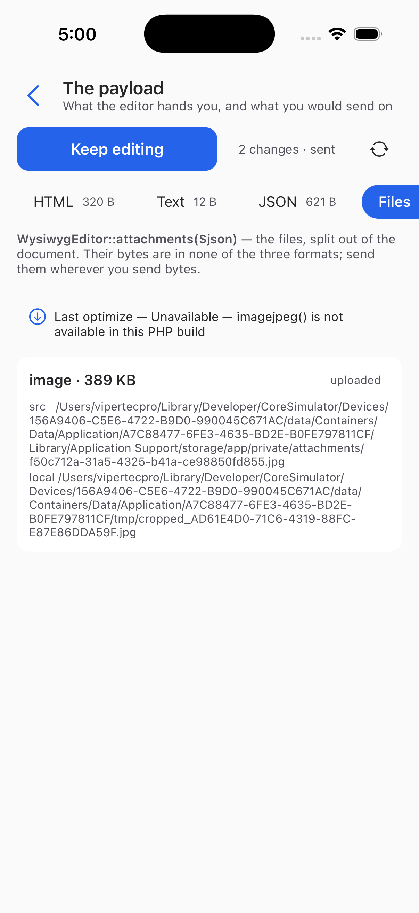 | 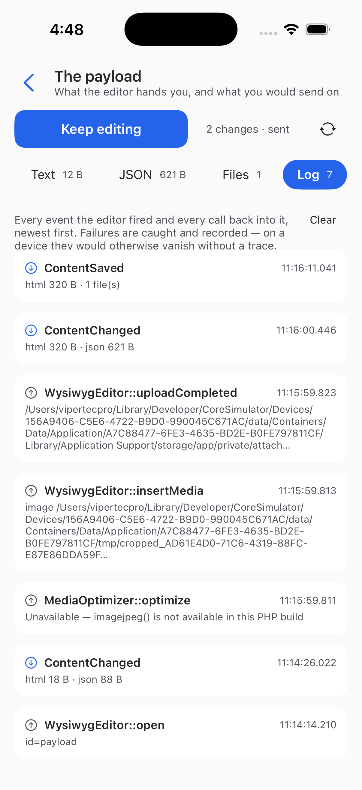 |

**The three formats.** `ContentSaved` hands you `$html`, `$text` and `$json`.
Which you store is a real decision, so their byte sizes sit on the tabs — a
document with four photos in it is not the same shape of request as one without.

**The files, separately.** Media is **not** embedded in any of the three: the
markup only references a path. `WysiwygEditor::attachments($json)` is the split,
and each row shows `src` (where the document points) and `local` (the file on
this device) as the different things they are, plus the size, the upload state,
and the correlation id while an upload is still in flight.

**The conversation.** Every event the editor fired and every call back into it,
newest first, timestamped — including failures. This is the part worth having:
an exception thrown inside an event handler on a phone leaves *nothing* behind,
no console and no stack trace, just a screen that quietly stopped updating. The
handlers here catch and record instead.

### Somewhere to stress it

The screen also has a **"Stress it — open 600 blocks"** control, which opens
the editor on a long article with headings, lists, quotes and links in it. A
coder passing a scale test off-device is not the same as an editor being usable
with that much loaded, and this is how you check the second one. It is how the
Android indent bug was found, which was invisible at two paragraphs and
unmissable at six hundred.

### Where compression belongs

Between the picker handing you a file and the editor being told about it, the
file is still yours — nothing has been uploaded and the editor has not seen it.
That is the seam, and `App\Support\MediaOptimizer` is it:

```php
$optimized = MediaOptimizer::optimize($pickedPath, 'image');

WysiwygEditor::insertMedia('image', ['localPath' => $optimized->path, ...]);
```

Whatever you return is what the user sees **and** what gets uploaded, so there
is no second copy to keep in step. Resize, re-encode, strip EXIF, convert HEIC,
or refuse a file that is too large and say why. Every failure path hands back
the original with the reason recorded — an unoptimized picture beats a lost one.

> **Worth knowing:** the PHP bundled inside a NativePHP app has no usable GD —
> `imagejpeg()` is absent — so image processing in PHP on the device is not
> available. It has to be a native plugin or happen server-side. The screen
> names the missing function rather than silently doing nothing, which is how we
> found out.

## The five platform demos

### X — short posts

No formatting at all, a countdown ring instead of a character counter, and
drafts when you back out. `toolbar => []` is a real configuration: a plain-text
composer is a product decision, not a missing feature.

| Writing | The timeline |
| --- | --- |
| 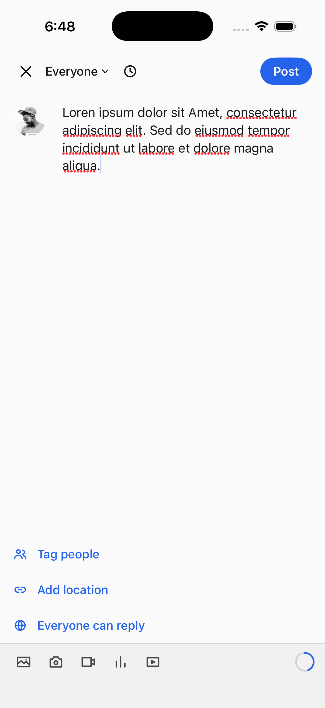 |  |

The rows under the text — *Tag people*, *Add location*, *Everyone can reply* —
are **host accessories**: the app declares them, the editor draws them inside
its own window, and taps come back as events. The editor has no idea what a
location is.

### LinkedIn — long-form

Mentions and hashtags, host sheets over the editor's own chrome, and a
see-more clamp on the feed.

| `@` looks people up | Posted |
| --- | --- |
| 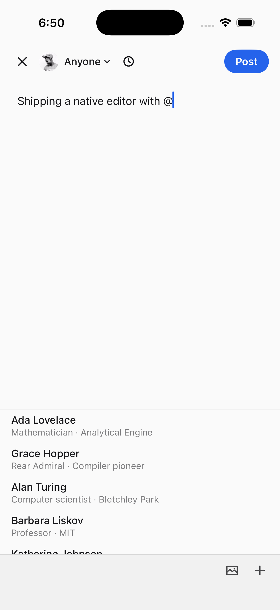 | 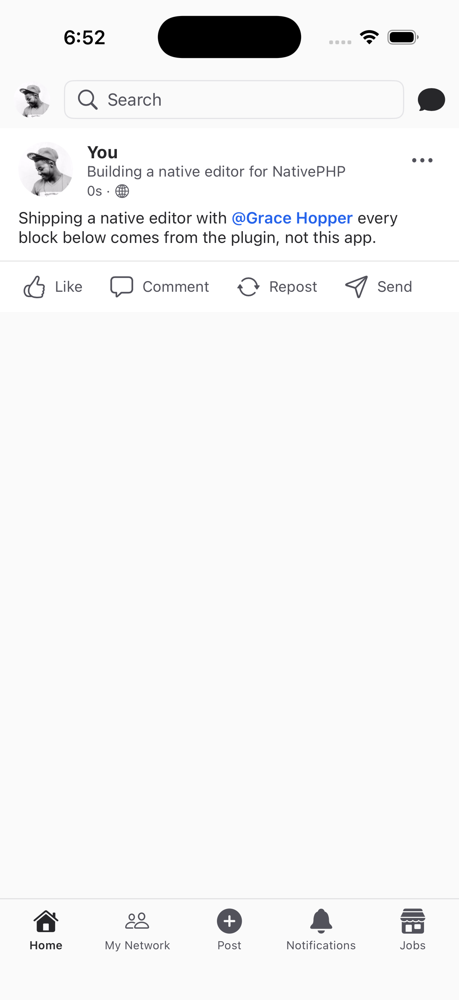 |

The editor spots the trigger and asks; **which** people exist is the app's
business, answered from its own database. The mention comes back in the saved
HTML as a real link.

### Facebook — a few words on a colour

Short posts become a card, and the same document renders in the feed.

| Picking a colour | The card |
| --- | --- |
| 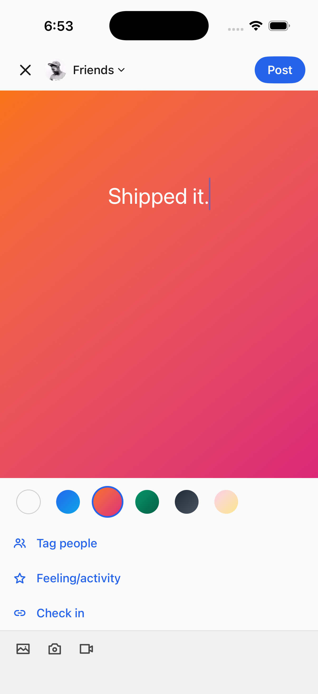 | 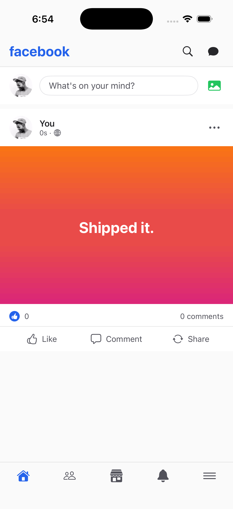 |

### Notion — block-based pages

A `/` palette, tables, and to-dos whose ticks survive the save.

| `/` offers the app's own commands | A table, edited where it sits |
| --- | --- |
| 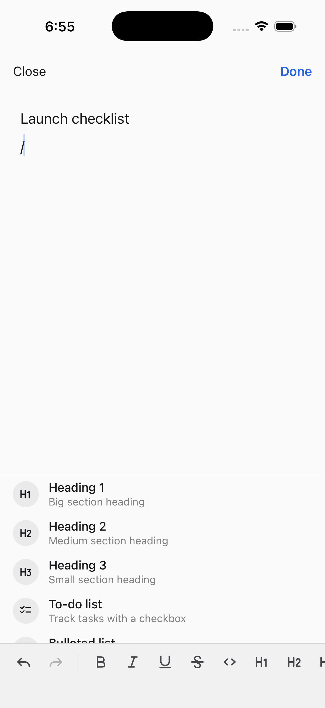 |  |


The command list is **the app's**, not the editor's. `/date` is in it precisely
because the editor has no idea what a date is: it reports the pick and the app
inserts one. That is how you add a command the plugin has never heard of.

A table saves as a real `<table>`, so whatever renders your stored markup gets
a table rather than an opaque blob.

### Apple Notes — native behaviour

No Save button anywhere, because the note is already written by the time you
would reach for one. Folders, pinning, and swipe-to-delete.

| Nothing to press | Swipe |
| --- | --- |
| 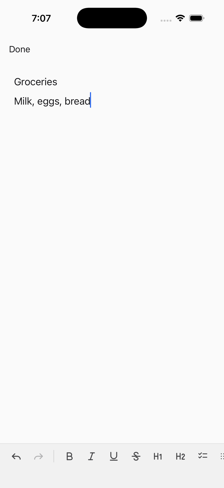 |  |

`changeDebounce` is the whole trick: the editor emits `ContentChanged` when
typing settles, the app writes it away, and `saveStyle => 'none'` removes the
button that would otherwise claim to do what the app is already doing.

### Also here

**Notes** (the full toolbar, saved to SQLite), **Comment Box** (the `comment`
preset — bold / italic / link, 500-character cap), **Composer** (every tool,
with a toggle to inspect the raw HTML), and **Branded Theme**.

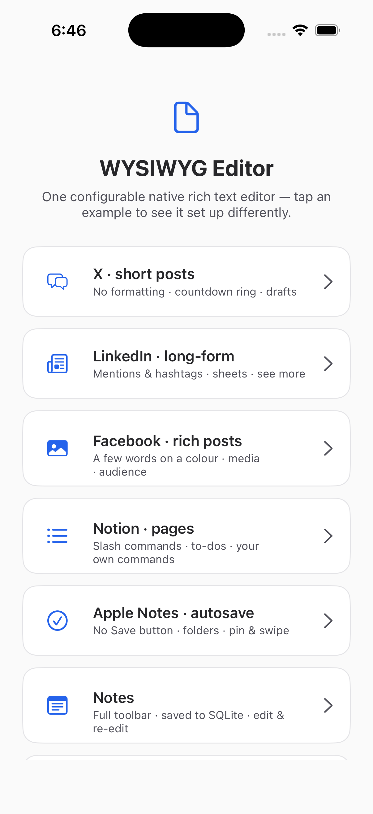

---

## The same code on Android

Everything above is iOS. Not one line of the demo changes for Android — the
plugin ships a Swift implementation and a Kotlin one, held to the same document
model by a parity test suite that runs both and compares the output byte for
byte. These are the same screens on a Pixel:

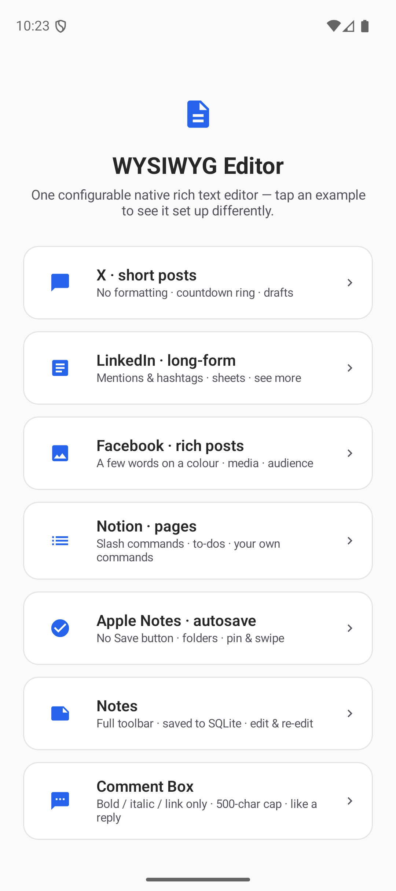

| X | LinkedIn | Facebook |
| --- | --- | --- |
| 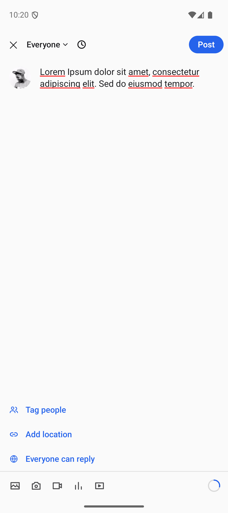 | 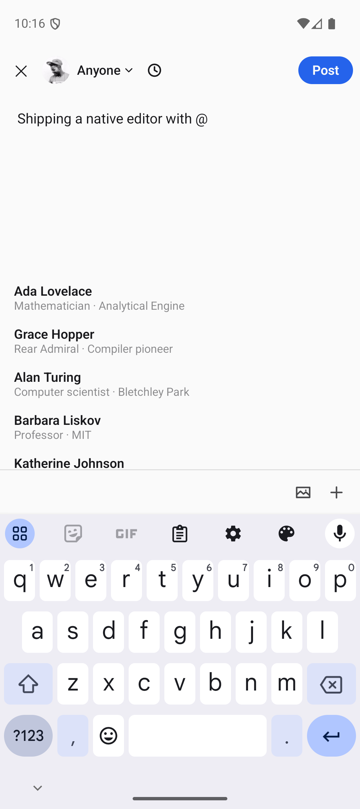 | 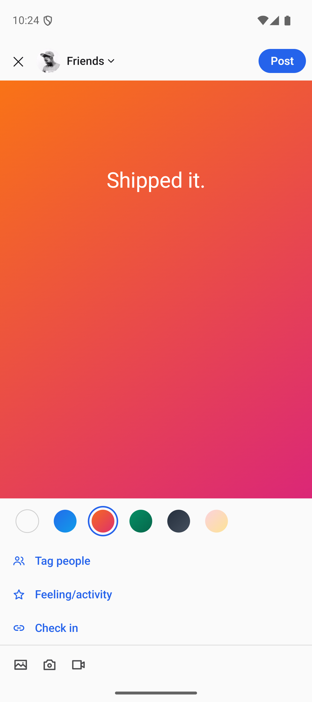 |

| `/` commands | Tables | Checklists |
| --- | --- | --- |
| 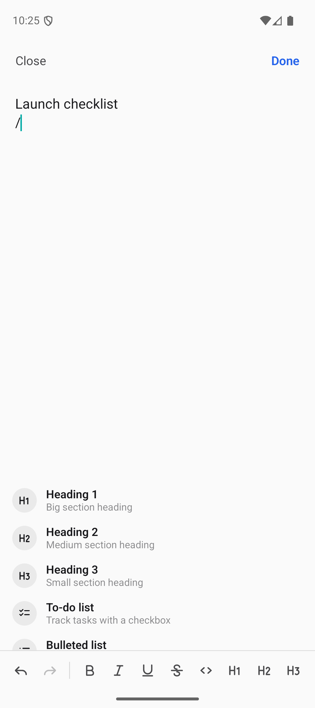 | 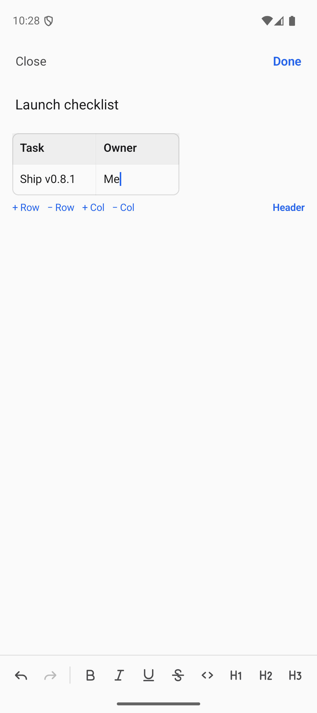 | 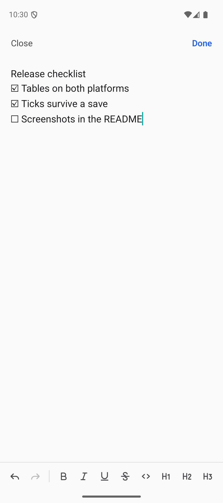 |

| Autosave | Swipe to delete |
| --- | --- |
| 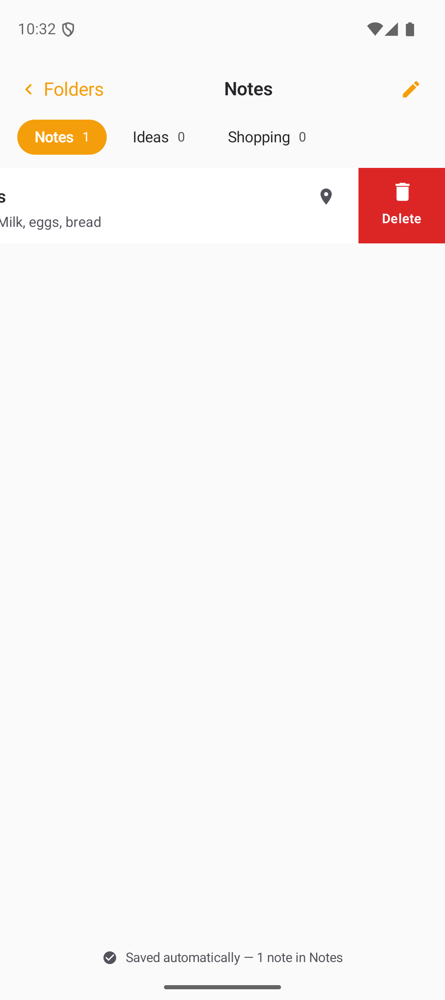 | 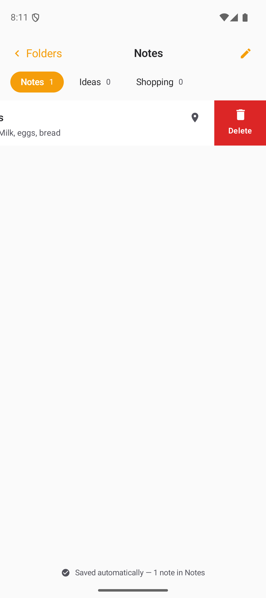 |

…and the payload screen, which is the same code reading the same events:

| The three formats | The files | The log |
| --- | --- | --- |
| 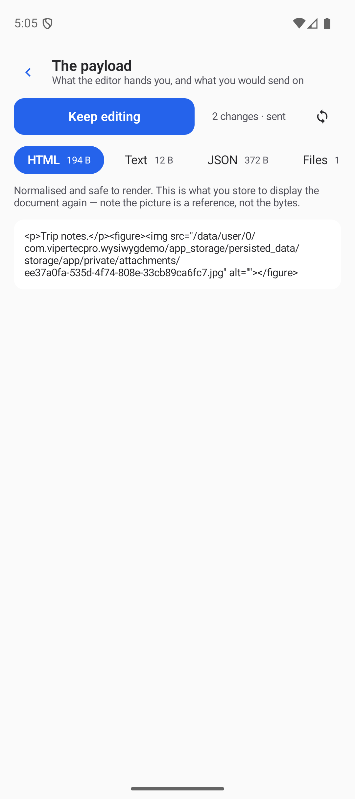 | 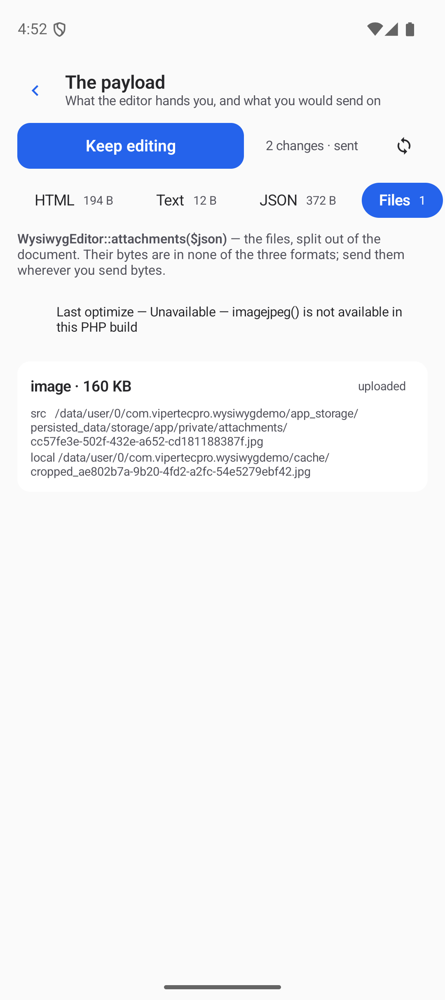 | 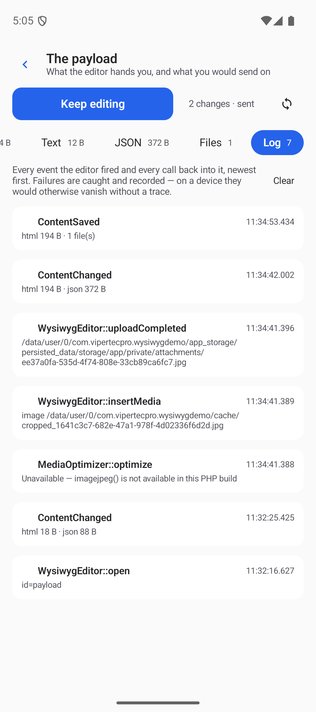 |

And what those composers saved, rendered back into each feed:

| X | LinkedIn | Facebook |
| --- | --- | --- |
| 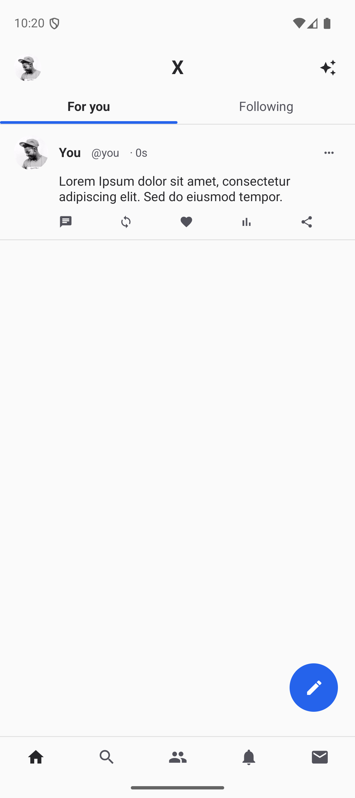 | 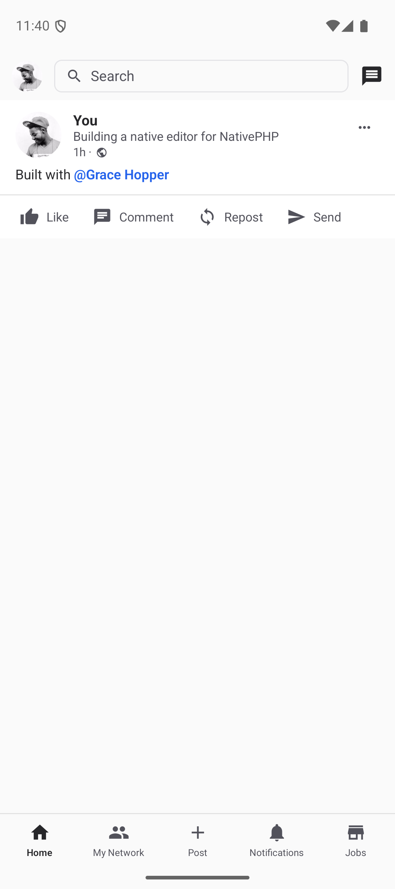 |  |

Each platform draws with its own native controls, so a table on Android is a
Compose grid and on iOS a SwiftUI one — but the HTML and JSON they save are
identical, which is the promise that matters when the same account opens a
document on both.

---

## Running it

```bash
composer install
```

```bash
cp .env.example .env && php artisan key:generate && php artisan migrate
```

The `.env` step is not optional: a clone has no `.env`, and without an
`APP_KEY` Laravel throws *"No application encryption key has been specified"*
the moment anything touches the session — including one of the tests.

```bash
php artisan native:run ios
```

Use `android` for the Android build. The first run downloads the platform
binaries and takes a while.

**Two things that will otherwise waste your afternoon:**

- **Android** needs `ANDROID_HOME` set, and `native:run android` prints a
  success banner even when Gradle fails — read `nativephp/android-build.log`
  rather than the console.
- The app only re-extracts its bundle when the version string changes, and
  compiled Blade views live inside the app container on both platforms. After
  changing a view, clear it or you will be looking at the previous build:

```bash
adb shell pm clear com.vipertecpro.wysiwygdemo
```

```bash
xcrun simctl uninstall booted com.vipertecpro.wysiwygdemo
```

This app requires the **published** plugin from Packagist, so cloning it and
running `composer install` is all there is to it.

If you are working on the plugin itself and want this app to use your checkout
rather than the release, point Composer at it:

```bash
composer config repositories.plugin path ../wysiwyg-editor && composer update vipertecpro/wysiwyg-editor
```

That edit is local to your `composer.json` — do not commit it, or everyone
cloning this repo gets an install that only works on your machine.

---

## What an integration actually looks like

Opening the editor is one call. Everything else is an event.

```php
use Vipertecpro\WysiwygEditor\Events\ContentSaved;
use Vipertecpro\WysiwygEditor\Facades\WysiwygEditor;

WysiwygEditor::open($page->body_json ?: $page->body_html, [
    'toolbar' => ['bold', 'italic', 'h1', 'bulletList', 'checklist', 'table', 'link'],
    'triggers' => ['/' => 'command'],
    'id' => 'page-'.$page->id,
]);

#[On(ContentSaved::class)]
public function onSaved(string $html, string $text, string $json = '', ?string $id = null): void
{
    // ────────────────────────────────────────────────────────────────
    //  THIS IS WHERE YOUR API CALL GOES.
    // ────────────────────────────────────────────────────────────────
    //
    // Every screen in this demo writes to SQLite on the device, because a
    // demo has no server. You would PUT or PATCH here instead.
    //
    // You are handed the document THREE ways, and which you store is a real
    // decision:
    //
    //   $html — display markup. Normalised, safe to render.
    //   $text — the plain rendition, for search and previews.
    //   $json — the fidelity format. The ONLY one carrying which to-dos are
    //           ticked and which uploads are still in flight, so it is what
    //           you re-open the editor with.
    //
    // Media is NOT embedded in the HTML. Files come back as their own blocks,
    // so prose and attachments can be sent to different endpoints:
    //
    //   $attachments = WysiwygEditor::attachments($json);
    //   // → [['kind' => 'image', 'source' => '/var/…/IMG_0001.HEIC', …], …]
    //
    Page::whereKey((int) substr($id, 5))
        ->update(['body_html' => $html, 'body_text' => $text, 'body_json' => $json]);
}
```

Each demo screen is a `NativeComponent` plus a Blade view. The interesting part
of every one of them is the options array — that is the point.

## Tests

```bash
php artisan test
```

Beyond the models and helpers, the suite guards the things that broke here
before and would break again:

- no control is drawn whose handler does not exist;
- no handler sits on an element that cannot be pressed — `<image>` and `<text>`
  accept the directive on iOS and ignore it on Android, so a control written
  that way works on one platform and is dead on the other;
- no event directive is used that the precompiler does not recognise, because a
  misspelling is dropped in silence — `@swipe-delete` did nothing at all until
  it became `@swipeDelete`;
- no icon is used that Android cannot draw — the names are SF Symbols, and one
  with no Material equivalent renders as empty space rather than as an error;
- no component holds state that nothing ever reads.

Each of those exists because it happened here, and each fails naming the file
and the offending line rather than merely going red.

## Licence

MIT.
